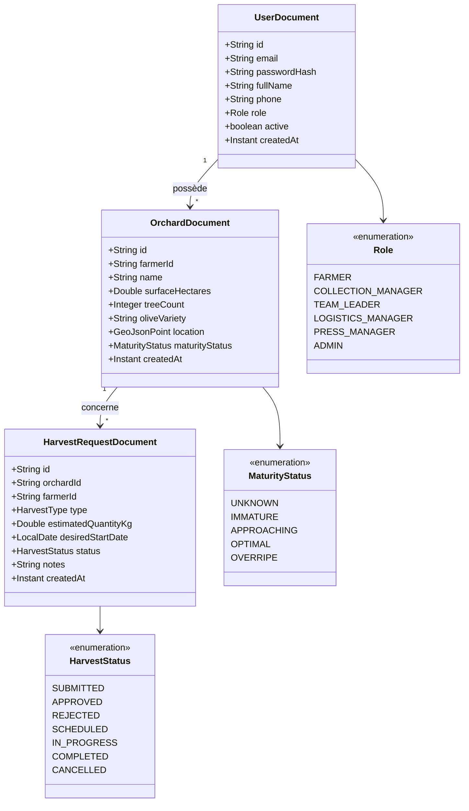

# Diagramme de Classes et Architecture 4 Couches

```mermaid
classDiagram
    class UserDocument {
        +String id
        +String email
        +String passwordHash
        +String fullName
        +String phone
        +Role role
        +boolean active
        +Instant createdAt
    }

    class OrchardDocument {
        +String id
        +String farmerId
        +String name
        +Double surfaceHectares
        +Integer treeCount
        +String oliveVariety
        +GeoJsonPoint location
        +MaturityStatus maturityStatus
        +Instant createdAt
    }

    class HarvestRequestDocument {
        +String id
        +String orchardId
        +String farmerId
        +HarvestType type
        +Double estimatedQuantityKg
        +LocalDate desiredStartDate
        +HarvestStatus status
        +String notes
        +Instant createdAt
    }

    class Role {
        <<enumeration>>
        FARMER
        COLLECTION_MANAGER
        TEAM_LEADER
        LOGISTICS_MANAGER
        PRESS_MANAGER
        ADMIN
    }

    class HarvestStatus {
        <<enumeration>>
        SUBMITTED
        APPROVED
        REJECTED
        SCHEDULED
        IN_PROGRESS
        COMPLETED
        CANCELLED
    }

    class MaturityStatus {
        <<enumeration>>
        UNKNOWN
        IMMATURE
        APPROACHING
        OPTIMAL
        OVERRIPE
    }

    UserDocument "1" --> "*" OrchardDocument : possède
    OrchardDocument "1" --> "*" HarvestRequestDocument : concerne
    UserDocument --> Role
    HarvestRequestDocument --> HarvestStatus
    OrchardDocument --> MaturityStatus
```
